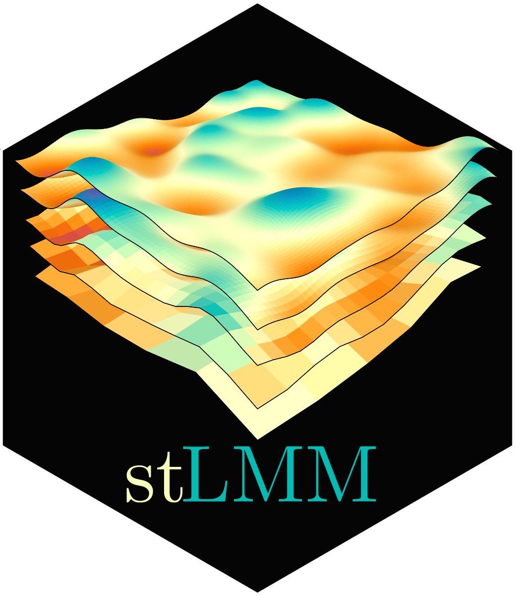

# stLMM



`stLMM` is an R package for fitting Bayesian linear mixed models with structured spatial, temporal, and space-time random effects. The package is designed for models whose latent terms can be represented through covariance or precision structures over point-referenced, areal, temporal, or grouped supports. Current terms include iid grouped effects, AR(1) temporal effects, Gaussian process and nearest-neighbor Gaussian process terms, CAR and DAGAR areal effects, and separable areal space-time effects.

The package was motivated by forest inventory and small-area estimation (SAE) problems where analysts often need to compare unit-level and area-level models over spatial and temporal domains. In these settings, the same data analysis may need point-referenced latent processes, area-level random effects, direct-estimate variance models, holdout prediction, and aggregation of posterior predictions to arbitrary reporting domains. Although this motivation comes from forest inventory, the modeling framework is general and should prove useful in many similar applied settings.

<br clear="left"/>

## Modeling Framework

The central design idea in `stLMM` is to use a common model specification for a collection of latent process terms that can be expressed through structured covariance or sparse precision matrices. With the exception of dense `gp()` terms, the structured terms are built around sparse precisions. This includes NNGP, AR(1), CAR, CAR-time, DAGAR, and DAGAR-time terms.

During fitting, structured latent process terms are integrated out. This collapsed specification reduces the dimension of the Markov chain Monte Carlo (MCMC) sampler: instead of updating thousands, millions, or more latent process values as model parameters, the sampler targets the lower-dimensional fixed effects, iid random effects, residual variance parameters, and covariance or precision parameters. Latent process values are recovered after fitting when they are needed for fitted values, prediction, diagnostics, or aggregation.

This gives the package a unified inferential engine across model terms and supports. A point-referenced NNGP, an areal CAR model, a DAGAR model, an AR(1) temporal effect, and a separable areal space-time effect all enter the sampler through common sparse linear algebra operations. Much of the implementation is therefore organized around sparse precision assembly and CHOLMOD sparse factorization.

## Tradeoffs

The collapsed approach is not the fastest way to fit these models. Some latent-variable formulations can exploit model-specific full conditionals, blocking strategies, or specialized sparse updates that are more efficient for a particular model class. In those approaches, the MCMC sampler may have a much larger parameter space but simpler conditional updates.

`stLMM` takes the collapsed side of this tradeoff. It gives up the large latent-parameter representation and some of the algorithmic advantages that come with model-specific latent-variable samplers in exchange for a unified, lower-dimensional parameterization and a shared sparse-matrix inference strategy. That makes it easier to compare related model classes, reuse sampler machinery across supports, and evaluate how far sparse CHOLMOD-based computations can carry collapsed Gaussian mixed model specifications. The package is therefore not intended to replace every specialized implementation for every model term. Its purpose is to provide a coherent framework for specifying, fitting, recovering, and predicting from a broad class of related spatial, temporal, and space-time mixed models.

In practice, the package is aimed at small to moderate scale Bayesian analyses. Feasible problem size depends on hardware, graph structure, MCMC settings, and the model terms used, but the intended range is roughly up to a few hundred thousand latent nodes for point-referenced NNGP models and potentially several million latent nodes for sparse areal models. Larger analyses may require more specialized algorithms, stronger approximation, or additional computing infrastructure.

## Where It Fits

The R ecosystem already includes strong software for mixed models, spatial statistics, Gaussian processes, disease mapping, and SAE. Many of those packages are faster or more mature for the specific model classes they target. `stLMM` is intended to sit between those specialized tools: it emphasizes a single formula grammar, a common collapsed sparse-precision implementation, and post-fitting workflows that make it practical to compare unit-level and area-level spatial and space-time models.

That design is especially useful when the scientific question is not only "fit this one model as fast as possible," but also "compare several plausible latent structures, residual variance specifications, likelihoods, and prediction supports using the same inferential framework."

## Model Terms

Current formula terms include:

- `iid(group)` for iid grouped random effects;
- `ar1(time)` for ordered temporal latent effects;
- `gp(...)` for small dense Gaussian process terms;
- `nngp(...)` for point-referenced spatial or space-time NNGP terms;
- `car(area, graph = g)` for areal CAR terms;
- `car_time(area, time, graph = g)` for separable areal space-time CAR terms;
- `dagar(area, graph = g)` for ordered DAGAR areal terms;
- `dagar_time(area, time, graph = g)` for separable DAGAR-time terms;
- `resid(...)` for Gaussian residual variance models, including the default homoskedastic variance, fixed row-specific variances, group-specific variances, and scaled direct-estimate variance models.

Terms can also be multiplied by covariates using formula interactions, for example `x:nngp(...)`, `x:car(...)`, or `x:car_time(...)`, to define structured varying coefficients.

The package supports Gaussian linear mixed models, binomial logistic mixed models, and fixed-size negative-binomial count models. The non-Gaussian families use Polya-Gamma augmentation and the same collapsed structured-process machinery.

For model-fit diagnostics, `log_lik()` returns observed-row pointwise log-likelihood matrices and `waic()` computes WAIC through the optional `loo` package.

## Installation

The package is not on CRAN. To install from GitHub, use:

```r
remotes::install_github("finleya/stLMM")
```

To build and install it from a local clone with vignettes, run:

```sh
git clone git@github.com:finleya/stLMM.git
cd stLMM
R CMD build .
R CMD INSTALL stLMM_0.0.1.tar.gz
```

The vignette build requires Quarto. After installation, start with the installed package vignettes:

```r
browseURL(system.file("doc", "index.html", package = "stLMM"))
```

The standard R vignette listing is also available with:

```r
browseVignettes("stLMM")
```

To build the local pkgdown site with the richer article layout, run:

```r
pkgdown::build_site(".")
browseURL("docs/index.html")
```

For a faster install without rebuilding vignettes, install the package source directory directly. This installs the package but does not install package vignette HTML or the standard vignette index.

```sh
R CMD INSTALL .
```

## Documentation

The installed package keeps its vignette set intentionally small so package builds and checks stay lightweight. The package vignette sources are:

- Getting started: `vignettes/v01-getting-started.qmd`
- Point-referenced NNGP: `vignettes/v02-spatial-nngp.qmd`
- Modeling and software details: `dev/modeling_and_software_details/stLMM.tex`

The broader article set, including areal models, likelihood extensions, diagnostics, runtime notes, applied workflows, and the PDF technical reference, is intended for the package website at <https://finleya.github.io/stLMM/>.

The modeling and software details document is the technical reference for the software design, notation, model terms, collapsed sampler, recovery, and prediction machinery.
